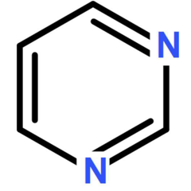

# pyrimidine

OO implement of genetic algorithm by python. See [pyrimidine's document](https://pyrimidine.readthedocs.io/) for more details.



## Why

Why is the package named as “pyrimidine”? Because it begins with “py”.

> — Are you kiding?
>
> — No, I am serious.

## Download

It has been uploaded to [pypi](https://pypi.org/project/pyrimidine/), so download it with `pip install pyrimidine`, and also could download it from github.

## Idea

We regard the population as a container of individuals, an individual as a container of chromosomes
and a chromosome as a container(array) of genes.

The container could be a list or an array.
Container class has an attribute `element_class`, telling itself the class of the elements in it.

Following is the part of the source code of `BaseIndividual` and `BasePopulation`.
```python
class BaseIndividual(BaseFitnessModel, metaclass=MetaContainer):
    element_class = BaseChromosome
    default_size = 1
    
class BasePopulation(BaseFitnessModel, metaclass=MetaHighContainer):
    element_class = BaseIndividual
    default_size = 20
```


There is mainly tow kinds of containers: list and tuple as in programming language `Haskell`. See following examples.

```python
# individual with chromosomes of type _Chromosome
_Individual1 = BaseIndividual[_Choromosome]
# individual with 2 chromosomes of type _Chromosome1 and _Chromosome2 respectively
_Individual2 = MixIndividual[_Chromosome1, _Chromosome2]
```


## New features

propose a mature concept/metaclass `System`, consisting of a set of elements and operators on it as an implementing of algebraic system.

## Use

### Main classes

- BaseGene: the gene of chromosome
- BaseChromosome: sequence of genes, represents part of a solution
- BaseIndividual: sequence of chromosomes, represents a solution of a problem
- BasePopulation: set of individuals, represents a set of a problem
                also the state of a stachostic process
- BaseSpecies: set of population for more complicated optimalization


### import
Just use the command `from pyrimidine import *` import all of the objects.

### subclass

#### Chromosome

Generally, it is an array of genes.

As an array of 0-1s, `BinaryChromosome` is used most frequently.

#### Individual
just subclass `MonoIndividual` in most cases.

```python
class MyIndividual(MonoIndividual):
    """individual with only one chromosome
    we set the gene is 0 or 1 in the chromosome
    """
    element_class = BinaryChromosome

    def _fitness(self):
        ...
```

Since class `MonoBinaryIndividual` is defined to be such individual, it is equivalent to

```python
class MyIndividual(MonoBinaryIndividual):
    # only need define the fitness
    def _fitness(self):
        ...
```


If an individual contains several chromosomes, then subclass `MultiIndividual`. It could be applied in multi-real-variable optimization problems.


In most cases, we have to decode chromosomes to real numbers.

```python
class _Chromosome(BinaryChromosome):
    def decode(self):
        """Decode a binary chromosome
        
        if the sequence of 0-1 represents a real number, then overide the method
        to transform it to a nubmer
        """

class ExampleIndividual(BaseIndividual):
    element_class = _Chromosome

    def _fitness(self):
        # define the method to calculate the fitness
        x = self.decode()  # will call decode method of _Chromosome
        return evaluate(x)
```


If the chromosomes in an individual are different with each other, then subclass `MixIndividual`, meanwhile, the property `element_class` should be assigned with a tuple of classes for each chromosome.

```python
class MyIndividual(MixIndividual):
    """
    Inherit the fitness from ExampleIndividual directly.
    It has 6 chromosomes, 5 are instances of _Chromosome, 1 is instance of FloatChromosome
    """
    element_class = (_Chromosome,)*5 + (FloatChromosome,)
```

It equivalent to `MyIndividual=MixIndividual[(_Chromosome,)*5 + (FloatChromosome,)]`

#### Population

```python
class MyPopulation(SGAPopulation):
    element_class = MyIndividual
```

`element_class` is the most important attribute of the class that defines the class of the individual of the population. It is equivalent to `MyPopulation=SGAPopulation[MyIndividual]`.


### Initialize randomly

#### Initialize a population

Generate a population, with 50 individuals and each individual has 100 genes

`pop = MyPopulation.random(n_individuals=50, size=100)`

When each individual contains 5 chromosomes.

`pop = MyPopulation.random(n_individuals=10, n_chromosomes=5, size=10)`

For `MixIndividual`, we recommand to use, for example

`pop = MyPopulation.random(n_individuals=10, sizes=(10,8,8,3))`

#### Initialize an individual

In fact, `random` method of `Population` will call random method of `Individual`. If you want to generate an individual, then just execute `MyIndividual.random(n_chromosomes=5, size=10)`, for simple individuals, just execute `SimpleIndividual.random(size=10)` since its `n_chromosomes` equals to 1.


### Evolution

#### `evolve` method
Initialize a population with `random` method, then call `evolve` method.

```python
pop = MyPopulation.random(n_individuals=50, size=100)
pop.evolve()
print(pop.best_individual)
```

set `verbose=True` to display the data for each generation.


#### History

Get the history of the evolution.

```python
stat={'Fitness':'fitness', 'Best Fitness': lambda pop: pop.best_individual.fitness}
data = pop.history(stat=stat)  # use history instead of evolve
```
`stat` is a dict mapping keys to function, where string 'fitness' means function `lambda pop:pop.fitness` which gets the mean fitness of pop. Since we have defined pop.best_individual.fitness as a property, `stat` could be redefine as `{'Fitness':'fitness', 'Best Fitness': 'best_fitness'}`.


#### performance

Use `pop.perf()` to check the performance.


## Example

### Example 1

Description

    select ti, ni from t, n
    sum of ni ~ 10, while ti dose not repeat

The opt. problem is

    min abs(sum_i{ni}-10) + maximum of frequences in {ti}
    where i is selected.

```python
t = np.random.randint(1, 5, 100)
n = np.random.randint(1, 4, 100)

import collections
def max_repeat(x):
    # maximum of numbers of repeats
    c = collections.Counter(x)
    bm=np.argmax([b for a, b in c.items()])
    return list(c.keys())[bm]

class MyIndividual(BinaryIndividual):

    def _fitness(self):
        x, y = self.evaluate()
        return - x - y

    def evaluate(self):
        return abs(np.dot(n, self.chromosome)-10), max_repeat(ti for ti, c in zip(t, self) if c==1)

class MyPopulation(SGAPopulation):
    element_class = MyIndividual

pop = MyPopulation.random(n_individuals=50, size=100)
pop.evolve()
print(pop.best_individual)
```


Notate that there is only one chromosome in `MonoIndividual`, which could be got by `self.chromosome` .

### Example2: Knapsack Problem

One of the famous problem is the knapsack problem. It is a good example for GA.

We set `history=True` in `evolve` method for the example, that will record the main data of the whole evolution. It will return an object of `pandas.DataFrame`. The argument `stat`  is a dict from a key to function/str(corresponding to a method) that map a population to a number. the numbers in one generation will be stored in a row of the dataframe.

see `# examples/example0`

```python
#!/usr/bin/env python3
# -*- coding: utf-8 -*-

from pyrimidine import MonoBinaryIndividual, SGAPopulation

from pyrimidine.benchmarks.optimization import *

# generate a knapsack problem randomly
evaluate = Knapsack.random(n=20)

class MyIndividual(MonoBinaryIndividual):
    def _fitness(self):
        return evaluate(self)


class MyPopulation(SGAPopulation):
    element_class = MyIndividual

pop = MyPopulation.random(size=20)

stat={'Mean Fitness':'mean_fitness', 'Best Fitness':'best_fitness'}
data = pop.evolve(stat=stat, history=True)
# data is an instance of DataFrame of pandas

import matplotlib.pyplot as plt
fig = plt.figure()
ax = fig.add_subplot(111)
data[['Mean Fitness', 'Best Fitness']].plot(ax=ax)
ax.set_xlabel('Generations')
ax.set_ylabel('Fitness')
plt.show()

```


## Extension

`pyrimidine` is extendable. It is easy to implement others iterative model, such as simulation annealing and particle swarm optimization.


Currently, it is recommended to define subclasses based on `BaseIterativeModel` as a maxin.

In PSO, we regard a particle as an individual, and `ParticleSwarm` as a population. But in the following, we subclass it from `BaseIterativeModel`

```python
# pso.py
class Particle(PolyIndividual):
    """A particle in PSO

    Variables:
        default_size {number} -- one individual represented by 2 chromosomes: position and velocity
        phantom {Particle} -- the current state of the particle moving in the solution space.
    """

    element_class = FloatChromosome
    default_size = 2
    phantom = None

    def backup(self):
        self.chromosomes[0] = self.position
        self.fitness = self.phantom.fitness

    def init(self):
        self.phantom = self.clone(fitness=self.fitness)

    # other methods


class ParticleSwarm(BaseIterativeModel):
    element_class = Particle
    default_size = 20
    params = {'learning_factor': 2, 'acceleration_coefficient': 3, 'inertia':0.5, 'n_best_particles':0.1, 'max_velocity':None}

    def init(self):
        self.best_particles = self.get_best_individuals(self.n_best_particles)
        for particle in self.particles:
            particle.init()

    def transit(self, *args, **kwargs):
        """
        Transitation of the states of particles
        """
        for particle in self:
            if particle.phantom.fitness > particle.fitness:
                particle.backup()
        for particle in self:
            if particle not in self.best_particles:
                for k, b in enumerate(self.best_particles):
                    if particle.fitness <= b.fitness:
                        break
                if k > 0:
                    self.best_particles.pop(k)
                    self.best_particles.insert(k, particle)
        self.move()

    def move(self):
        # moving rule of particles
        xi = random()
        eta = random()
        for particle in self:
            if particle in self.best_particles:
                particle.velocity = (self.inertia * particle.velocity
             + self.learning_factor * xi * (particle.best_position-particle.position))
            else:
                for b in self.best_particles:
                    if particle.fitness < b.fitness:
                        break
                particle.velocity = (self.inertia * particle.velocity
                 + self.learning_factor * xi * (particle.best_position-particle.position)
                 + self.acceleration_coefficient * eta * (b.best_position-particle.position))
            particle.position += particle.velocity
            particle.phantom.fitness = None
```

If you want to apply PSO, then you can define

```python
class MyParticleSwarm(ParticleSwarm, BasePopulation):
    element_class = _Particle
    default_size = 20

pop = MyParticleSwarm.random()
```


It is not coercive. It is possible to inherit `ParticleSwarm` from `BasePopulation` directly.

