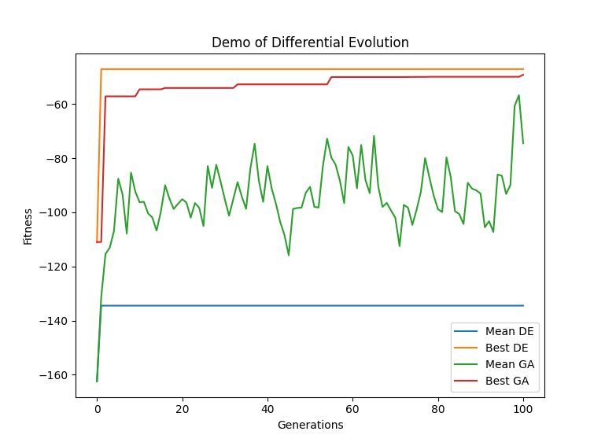
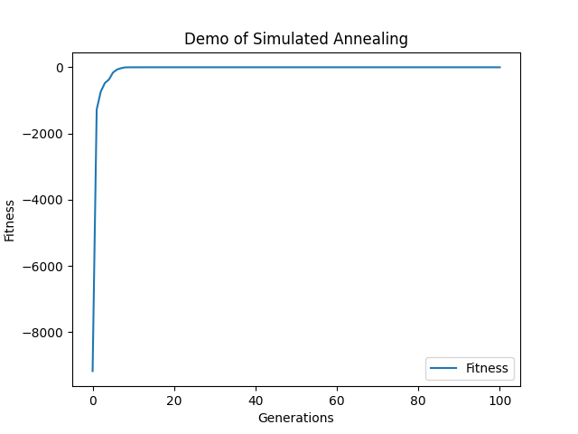

# Customization

In this section, we present more complicated examples.

## Customization Tricks

Take Partical Swarm Optimization(PSO) as an example for a quick look at the tricks of customization. First of all, define `class ParticleSwarm(PopulationModel):...`, as subclass of `PopulationModel`. `PopulationModel` is a mixin class where you have to define method `transit` to implement the PSO algorithm. Then assign `element_class` to be the type of particles, and set `default_size` as the number of the particles.

Since the package has provide a practical class for PSO, you only need set the attribute `element_class` to be your own particle class in most case. See `example-pso.py` in `examples`.

```python
class _Particle(BaseParticle):
    ...

class MyParticleSwarm(ParticleSwarm, metaclass=MetaContainer):

    element_class = _Particle
    default_size = 20
    ...
```

In the standard definition, as an individual, a particle has two "chromosomes", one represents the current position, the other represents the current velocity. While, you can define three or more chromosomes, to include the acceleration. It also has an important attribute, `memory` storing the best position that the particle passed-by.


## Simulated Annealing Algorithm
See the following code for SA Algorithm. The standard SA is an iteration of one solution. Hence we inherit it from `FitnessModel` instead of `PopulationModel`

```python
#!/usr/bin/env python3

class SimulatedAnnealing(FitnessModel):
    """Class for Simulated Annealing
    
    Attributes:
        params (dict): parameters in SA
        phantom: phantom solution for exploration
    """

    phantom = None

    params = {'ext_c': 0.995,
        'int_c': 0.996,
        'nepoch': 200,
        'initT': 100,      # initial temperature
        'termT': 0.0001    # terminal temperature
        }

    def init(self):
        self.phantom = self.copy(fitness=None)

    def transition(self, *args, **kwargs):
        T = self.initT
        for epoch in range(self.nepoch):
            self.phantom.move(T)
            T *= self.int_c
            if T < self.termT:
                break
        if self.fitness < self.phantom.fitness:
            self.chromosomes = self.phantom.chromosomes
            self.fitness = self.phantom.fitness

    def postprocess(self):
        self.initT *= self.ext_c


    def move(self, T):
        """Transition of states
        
        Arguments:
            T {number} -- temperature
        """

        cpy = self.get_neighbour()

        # Metropolis rule
        flag = metropolis_rule(D=cpy.fitness - self.fitness, T=T)
        if flag:
            self.chromosomes = cpy.chromosomes
            self.fitness = cpy.fitness
```

## Differential Evolution

The standard DE is a global searching algorithm. The class `DifferentialEvolution` for DE is inherited from `PopulationModel`.

```python
class DifferentialEvolution(PopulationModel):

    params ={
    "factor" : 0.25,
    "cross_prob": 0.75,
    }

    test_individuals = []

    def init(self):
        self.dimension = len(self.individuals[0][0])
        self.test = self.clone()

    def transit(self, *args, **kwargs):
        self.move()
        for k, (test_individual, individual) in enumerate(zip(self.test, self)):
            if test_individual.fitness > individual.fitness:
                self.individuals[k] = test_individual

    def move(self):
        for t in self.test:
            x0, x1, x2 = choice(self.individuals, size=3, replace=False)

            jrand = np.random.randint(0, self.dimension)
            xx = x0.chromosome + self.factor * (x1.chromosome - x2.chromosome)
            for j in range(self.dimension):
                if random()<self.cross_prob or j == jrand:
                    t.chromosomes[0][j] = xx[j]
```

After running `comparison-de.py`, we get the following fitness curves.




## Local Search

### Simulated Annealing Algorithm
Different from GA, DE or other algorithms based on the population, simulated annealing is based on single individual. It is a sort of local search. Following is the skelton of SA.

```python
# import statsments

class SimulatedAnnealing(PhantomIndividual):
    """Class for Simulated Annealing
    
    Attributes:
        params (dict): parameters in SA
        phantom: phantom solution for exploration
    """

    phantom = None

    params = {'ext_c': 0.99,  # external coef
        'int_c': 0.99,        # internal coef
        'n_epochs': 200,
        'initT': 100,         # initial temperature
        'termT': 0.0001       # terminal temperature
        }

    def init(self):
        # initialize phantom solution
        self.phantom = self.copy(fitness=None)


    def transit(self, *args, **kwargs):
        T = self.initT
        for epoch in range(self.n_epochs):
            self.move(T)
            T *= self.int_c
            if T < self.termT:
                break
        # set the phantom to be the true solution (if it is better then the previous record)
        self.backup()
        self.initT = T * self.ext_c


    def move(self, T):
        """Move phantom
        
        Arguments:
            T {number} -- temperature
        """

        cpy = self.phantom.get_neighbour()

        # Metropolis rule
        flag = metropolis_rule(D=cpy.fitness - self.phantom.fitness, T=T)
        if flag:
            self.phantom.chromosomes = cpy.chromosomes
            self.phantom.fitness = cpy.fitness
    ```


```python
# import statements

n = 15
f = rosenbrock(n=n)

class MyIndividual(SimulatedAnnealing, MonoIndividual):
    element_class = FloatChromosome.set(default_size=n)

    def _fitness(self):
        return -f(self.chromosome)

    def get_neighbour(self):
        cpy = self.clone()
        cpy.mutate()
        # or cpy.chromosomes[0] = cpy.chromosome.random_neighbour()
        return cpy


ind = MyIndividual.random()

stat = {'Fitness':'_fitness'}
data = ind.evolve(stat=stat, n_iter=100, history=True)


import matplotlib.pyplot as plt
fig = plt.figure()
ax = fig.add_subplot(111)
data[['Fitness']].plot(ax=ax)
ax.set_xlabel('Generations')
ax.set_ylabel('Fitness')
ax.set_title('Demo of Simulated Annealing')
plt.show()
```



### Tabu Searching

```python
class BaseTabuSearch(BaseIndividual):
    """Tabu Search algorithm
    """

    params = {'value': 0,
        'tabu_list': [],
        'actions': [],
        'tabu_size': 10
        }

    def init(self):
        self.best_fitness = self.fitness

    def transit(self, *args, **kwargs):
        action = choice(self.actions)
        cpy = self.move(action)
        if action not in self.tabu_list:
            if cpy.fitness > self.best_fitness:
                self.chromosomes = cpy.chromosomes
                self.best_fitness = cpy.fitness
        else:
            if cpy.fitness > self.best_fitness:
                self.chromosomes = cpy.chromosomes
                self.best_fitness = cpy.fitness
                self.tabu_list.remove(action)
        self.update_tabu_list()

    def update_tabu_list(self):
        if len(self.tabu_list) > self.tabu_size:
            self.tabu_list.pop(0)

    def move(self, action):
        raise NotImplementedError
```

## Hacking