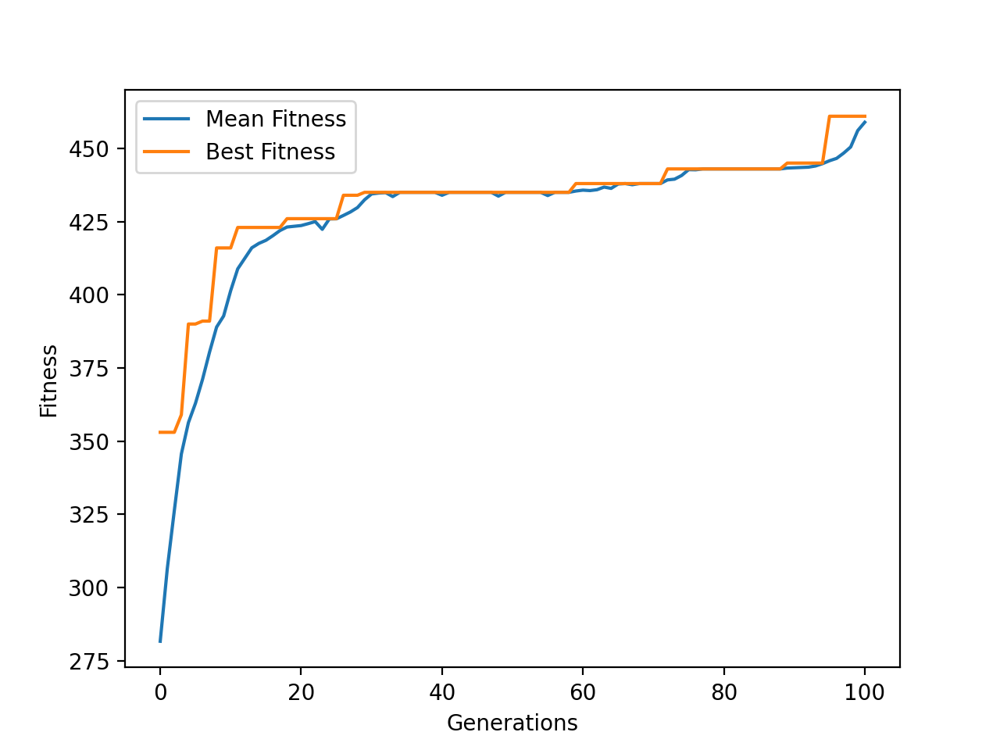

# Examples and customization tricks

## A simple example

One of the famous problem is the knapsack problem. It is a good example for GA.

```python
#!/usr/bin/env python3
# -*- coding: utf-8 -*-

from pyrimidine import MonoBinaryIndividual, SGAPopulation

from pyrimidine.benchmarks.optimization import *

# Generate a knapsack problem randomly
# Users can replace it with your owen goal functions
evaluate = Knapsack.random(n=20)

class MyIndividual(MonoBinaryIndividual):
    def _fitness(self):
        return evaluate(self)


class MyPopulation(SGAPopulation):
    element_class = MyIndividual

pop = MyPopulation.random(size=20)
pop.evolve()
print(pop.best_individual)
```

Following is an equivalent expression without `class` keward.
```python
MyPopulation = SGAPopulation[MonoBinaryIndividual.set_fitness(lambda o: _evaluate(o.chromosome))]
pop = MyPopulation.random(n_individuals=20, size=n)
pop.evolve()
```

For visualization, just use `history` (DataFrame object) instead.

```python
stat={'Mean Fitness':'mean_fitness', 'Best Fitness':'best_fitness'}
data = pop.history(stat=stat)
# data is an instance of DataFrame of pandas

import matplotlib.pyplot as plt
fig = plt.figure()
ax = fig.add_subplot(111)
data[['Mean Fitness', 'Best Fitness']].plot(ax=ax)
ax.set_xlabel('Generations')
ax.set_ylabel('Fitness')
plt.show()
```




## Create new algo.

In the following example, the binary chromosomes should be decoded to floats. We recommend `digit_converter` created by the author to handle it.

```python
#!/usr/bin/env python3
# -*- coding: utf-8 -*-

from pyrimidine.benchmarks.special import *

from pyrimidine import *
from digit_converter import *

def evaluate(x):
    return -rosenbrock(8)(x)

c=IntervalConverter(-5,5)


class _Chromosome(BinaryChromosome):
    def decode(self):
        return c(self)


class uChromosome(BinaryChromosome):
    def decode(self):
        return unitIntervalConverter(self)


class Mixin:
    def _fitness(self):
        x = [self[k].decode() for k in range(8)]
        return evaluate(x)

class ExampleIndividual(Mixin, MultiIndividual):
    element_class = _Chromosome

class MyIndividual(Mixin, MixIndividual[(_Chromosome,)*8 + (uChromosome,)]):
    """my own individual class
    
    Method `mate` is overriden.
    """
    ranking = None
    threshold = 0.25

    @property
    def threshold(self):
        return self.chromosomes[-1].decode()


    def mate(self, other, mate_prob=None):

        if other.ranking and self.ranking:
            if self.threshold <= other.ranking and other.threshold <= self.ranking:
                return super(MyIndividual, self).mate(other, mate_prob=0.9)
            else:
                mate_prob = 1 - (self.threshold + other.threshold)/2
                return super(MyIndividual, self).mate(other)
        else:
            return super(MyIndividual, self).mate(other)

class MyPopulation(SGAPopulation):
    element_class = MyIndividual
    def transit(self, *args, **kwargs):
        self.sort()
        self.select()
        self.mate()
        self.mutate()


if __name__ == '__main__':

    stat = {'Mean Fitness':'mean_fitness', 'Best Fitness': 'best_fitness'}

    import matplotlib.pyplot as plt
    fig = plt.figure()
    ax = fig.add_subplot(111)

    _Population = SGAPopulation[ExampleIndividual]
    pop = _Population.random(n_individuals=20, n_chromosomes=8, size=10)
    d = pop.history(n_iter=100, stat=stat)
    ax.plot(d.index, d['Mean Fitness'], d.index, d['Best Fitness'], '.-')

    pop = MyPopulation.random(n_individuals=20, sizes=[10]*8+[10])
    d = pop.history(n_iter=100, stat=stat)
    ax.plot(d.index, d['Mean Fitness'], d.index, d['Best Fitness'], '.-')
    ax.legend(('Traditional mean','Traditional best', 'New mean', 'New best'))
    plt.show()

```


