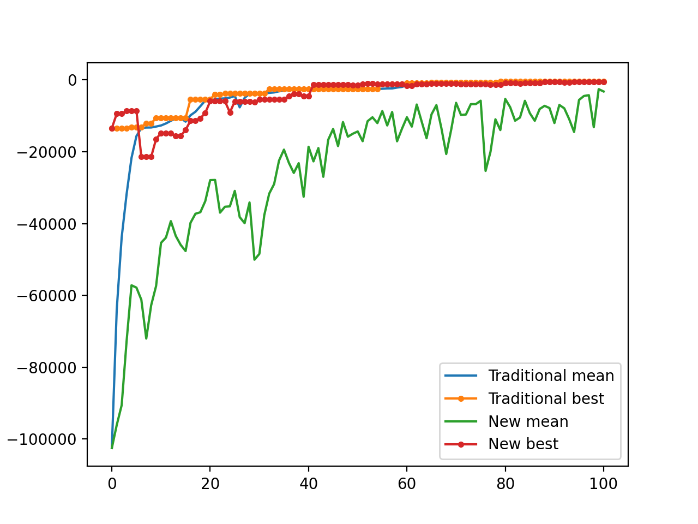

# Examples and Comparison of Algorithms

Let's see some examples for learning to use `pyrimidine`.

## Example 1

### A simple example --- Knapsack problem

One of the well-known problem is the knapsack problem. It is a good example for GA.

#### Codes

```{literalinclude} ../../examples/example.py
:language: python
:caption: examples/example.py
:linenos:
:lines: 1-56
```

#### Visualization
For visualization, just set `history=True` in the evolve method. It will return `DataFrame` object. Then draw the data by the methods of the object.

```{literalinclude} ../../examples/example.py
:language: python
:lineno-start: 58
:lines: 58-
```


### Another Problem

Given several problems with two properties: type and number. Select some elements from them, make sure the sum of the numbers equals to an constant $M$ and minimize the repetition of types.
$$
\min  R=\max_t |\{t_i=t,i\in I\}|\\
\sum_{i\in I} n_i=M\\
t_i \in T, n_i \in N
$$
We encode a solution with binary chromosome, that means 0/1 presents to be unselected/selected.

```{literalinclude} ../../examples/example1.py
:language: python
:caption: examples/example1.py
:linenos:
```


Print the statistical results:
```
iteration & solution & Mean Fitness & Best Fitness & Standard Deviation of Fitnesses & number
-------------------------------------------------------------
0 & 01100010011111010100100110111010001110101100011111 & 243.8 & 302 & 28.589508565206224 & 10
1 & 01100010011111010100100110111010001110101100011111 & 252.71428571428572 & 302 & 23.944664098197542 & 7
2 & 01100010011111010100100110111010001110101100011111 & 278.57142857142856 & 302 & 20.631855694235433 & 7
3 & 01100010011111010100100110111010001110101100011111 & 278.7142857142857 & 302 & 20.526737168276654 & 7
4 & 01100010011111010100100110111010001110101100011111 & 280.14285714285717 & 302 & 20.910889654016373 & 7
...
```


## Example 2

In the following example, the binary chromosomes should be decoded to floats. We recommend `digit_converter` to handle with it, created by the author for such purpose.

We will use `MixedIndividual` to encode the `threshold` for a novel algorithm.

```{literalinclude} ../../examples/example2.py
:language: python
:caption: examples/example2.py
:linenos:
:lines: 1-69
```


### Comparison of Algorithms


```{literalinclude} ../../examples/example2.py
:language: python
:lineno-start: 74
:lines: 74-
:dedent:
```



## Example 3 --- Evolution Strategy

```{literalinclude} ../../pyrimidine/es.py
:language: python
:caption: pyrimidine/es.py
:linenos:
:lines: 1,10-
```


```{literalinclude} ../../examples/example-es.py
:language: python
:caption: examples/example-es.py
:linenos:
:lines: 1,3-
```

## Example 4 --- Quantum GA
Here we create Quantum GA.

### use `QuantumChromosome`
Quantum GA is based on quantum chromosomes, `QuantumChromosome`. Let use have a look at the source code. It is recommended to use decorate `@basic_memory` to save the best measure result of a quantum chromosome.

```python
class QuantumChromosome(CircleChromosome):

    measure_result = None

    def decode(self):
        self.measure()
        return self.measure_result

    def measure(self):
        # measure a QuantumChromosome to get a binary sequence
        rs = np.random.random(size=(len(self),))
        self.measure_result = np.cos(self) ** 2 > rs
        self.measure_result.astype(np.int_)
```

### Create quantum GA

```python
#!/usr/bin/env python3

# import statements

from pyrimidine.deco import basic_memory, fitness_cache

import numpy as np
np.random.seed(6575)


# generate a knapsack problem randomly
n_bags = 50
evaluate = Knapsack.random(n=n_bags)


@basic_memory
class YourIndividual(BinaryChromosome // n_bags):

    def _fitness(self):
        return evaluate(self.decode())


@basic_memory
class MyIndividual(QuantumChromosome // n_bags):

    def _fitness(self):
        return evaluate(self.decode())


class Population(HOFPopulation):
    default_size = 20

    def backup(self, check=True):
        for i in self:
            i.backup(check=check)

    def update_hall_of_fame(self, *args, **kwargs):
        """
        Update the `hall_of_fame` after each step of evolution
        """
        self.backup()
        super().update_hall_of_fame(*args, **kwargs)


MyPopulation = Population[MyIndividual]
YourPopulation = Population[YourIndividual]
```

### Visualization and comparison

```python
stat={'Mean Fitness': 'mean_fitness', 'Best Fitness': 'max_fitness'}
mypop = MyPopulation.random()
yourpop = YourPopulation([YourIndividual(i.decode()) for i in mypop])

mydata = mypop.evolve(max_iter=100, stat=stat, history=True)
yourdata = yourpop.evolve(max_iter=100, stat=stat, history=True)

import matplotlib.pyplot as plt
fig = plt.figure()
ax = fig.add_subplot(111)
yourdata[['Mean Fitness', 'Best Fitness']].plot(ax=ax)
mydata[['Mean Fitness', 'Best Fitness']].plot(ax=ax)
ax.legend(('Mean Fitness', 'Best Fitness', 'Mean Fitness(Quantum)', 'Best Fitness(Quantum)'))
ax.set_xlabel('Generations')
ax.set_ylabel('Fitness')
ax.set_title(f'Demo of (Quantum)GA: {n_bags}-Knapsack Problem')
plt.show()
```


## Example 5 --- MultiPopulation

It is extremely natural to implement multi-population GA by `pyrimidine`.

```python
#!/usr/bin/env python3

# import statements
# setting the seed

# generate a knapsack problem randomly
n_bags = 100
_evaluate = Knapsack.random(n_bags)

class _Individual(MonoIndividual[BinaryChromosome // n_bags]):

    def decode(self):
        return self[0]

    def _fitness(self):
        return _evaluate(self.decode())


class _Population(HOFPopulation):
    element_class = _Individual
    default_size = 10


class _MultiPopulation(MultiPopulation):
    element_class = _Population
    default_size = 2


mp = _MultiPopulation.random()
data = mp.evolve(max_iter=100, history=True)
```

Equivalently

```python
#!/usr/bin/env python3

import numpy as np

from pyrimidine import MultiPopulation, HOFPopulation, PolyIndividual, BinaryChromosome
from pyrimidine.benchmarks.optimization import *

import numpy as np
np.random.seed(6575)


# generate a knapsack problem randomly
n_bags = 100
_evaluate = Knapsack.random(n_bags)

_Individual = (BinaryChromosome // n_bags).set_fitness(_evaluate)
_Population = HOFPopulation[_Individual] // 10
_MultiPopulation = MultiPopulation[_Population] // 2

# or in one line elegently,
# _MultiPopulation = MultiPopulation[HOFPopulation[BinaryChromosome // n_bags] // 10].set_fitness(_evaluate) // 2

mp = _MultiPopulation.random()
data = mp.evolve(max_iter=100, history=True)
```

Plot the fitness curves as usual.
```python
import matplotlib.pyplot as plt
fig = plt.figure()
ax = fig.add_subplot(111)
data[['Mean Fitness', 'Best Fitness']].plot(ax=ax)
ax.set_xlabel('Generations')
ax.set_ylabel('Fitness')
plt.show()
```

### Source code

Following is the core code to implement multi-population where we just introduce `migrate` method into `transition`.

```python
class BaseMultiPopulation(PopulationMixin, metaclass=MetaHighContainer):
    
    element_class = BasePopulation
    default_size = 2

    def migrate(self):
        # exchange the best individules between any two populations

    def transition(self, *args, **kwargs):
        self.migrate()
        for p in self:
            p.transition(*args, **kwargs)
```

Left the users to think that what will happen, if remove the `migrate` method.

One can consider higher-order multi-population, the container of multi-populations.

### Hybrid-population
It is possible mix the individuals(or chromosomes as the individuals) and populations in the multipopulation (named hybrid-population)

```python
#!/usr/bin/env python3

from random import random
import numpy as np

from pyrimidine import HybridPopulation, HOFPopulation, BinaryChromosome
from pyrimidine.benchmarks.optimization import *

import numpy as np
np.random.seed(6575)


# generate a knapsack problem randomly
n_bags = 100
_evaluate = Knapsack.random(n_bags)

_Individual = (BinaryChromosome // n_bags).set_fitness(_evaluate)


_Population = HOFPopulation[_Individual] // 5


class _HybridPopulation(HybridPopulation[_Population, _Population, _Individual, _Individual]):

    def max_fitness(self):
        # compute maximum fitness for statistics
        return max(self.get_all_fitness())


sp = _HybridPopulation.random()
data = sp.evolve(max_iter=100, history=True)


import matplotlib.pyplot as plt
fig = plt.figure()
ax = fig.add_subplot(111)
data[['Mean Fitness', 'Best Fitness']].plot(ax=ax)
ax.set_xlabel('Generations')
ax.set_ylabel('Fitness')
ax.set_title('Demo of Hybrid Population (Mixed by individuals and populations)')
plt.show()
```

## Exmaple 6 --- Game

Let's play the "scissors, paper, stone" game. We do not need fitness here, so just subclass `CollectiveMixin`, regarded as a Population without fitness.

```python
#!/usr/bin/env python

# import statements


class Player:
    """
    Play the "scissors, paper, stone" game

    `scissors`, `paper`, `stone` = 0, 1, 2
    """

    params = {'mutate_prob': 0.1}

    def __init__(self, strategy=0, score=0):
        self.strategy = strategy # 1,2
        self.score = score

    @classmethod
    def random(cls):
        return cls(strategy=randint(0, 2), score=0)

    def clone(self, *args, **kwargs):
        return self.__class__(self.strategy, self.score)

    def mutate(self):
        self.strategy = randint(0, 2)

    def init(self):
        pass

    def __lt__(self, other):
        return ((self.strategy, other.strategy) == (0, 1)
            or (self.strategy, other.strategy) == (1, 2)
            or (self.strategy, other.strategy) == (2, 0))

    def __str__(self):
        return f'{self.strategy}: {self.score}'


class Game(CollectiveMixin, metaclass=MetaContainer):

    params = {'compete_prob': 0.5, 'mutate_prob': 0.2}

    element_class = Player
    default_size = 100

    def transition(self, *args, **kwargs):
        self.compete()
        self.duplicate()
        self.mutate()

    def mutate(self, mutate_prob=None):
        for player in self:
            if random() < (mutate_prob or self.mutate_prob):
                player.mutate()

    def compete(self):
        k = int(0.5 * self.default_size)
        winner = []
        for i, p in enumerate(self[:-1]):
            for j, q in enumerate(self[:i]):
                if random() < self.compete_prob:
                    if p < q:
                        p.score += 1
                        q.score -= 1      
                    elif q < p:
                        p.score -= 1
                        q.score += 1
        winners = np.argsort([p.score for p in self])[-k:]
        self.elements = [self.elements[k] for k in winners]

    def duplicate(self):
        self.extend(self.clone())


game = Game.random()
stat = {'scissors': lambda game: sum(p.strategy==0 for p in game),
'paper': lambda game: sum(p.strategy==1 for p in game),
'stone': lambda game: sum(p.strategy==2 for p in game)
}
data = game.evolve(stat=stat, history=True)

import matplotlib.pyplot as plt
fig = plt.figure()
ax = fig.add_subplot(111)
data[['scissors', 'paper', 'stone']].plot(ax=ax)
ax.set_title("Have a zero-sum game")
plt.show()
```


