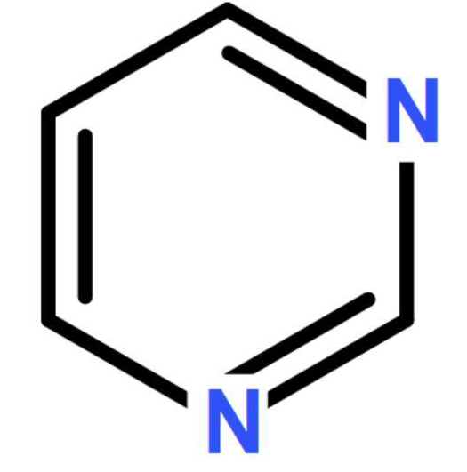

.. pyrimidine documentation master file, created by
   sphinx-quickstart on Sun Sep 20 13:05:18 2020.
   You can adapt this file completely to your liking, but it should at least
   contain the root `toctree` directive.

Welcome to pyrimidine's world, a new framework for genetic algorithm
====================================================================

.. toctree::
   :maxdepth: 2
   :caption: Contents:

   Home
   Install
   API Reference
   Examples
   Customize

Indices and tables
==================

* :ref:`genindex`
* :ref:`modindex`
* :ref:`search`
