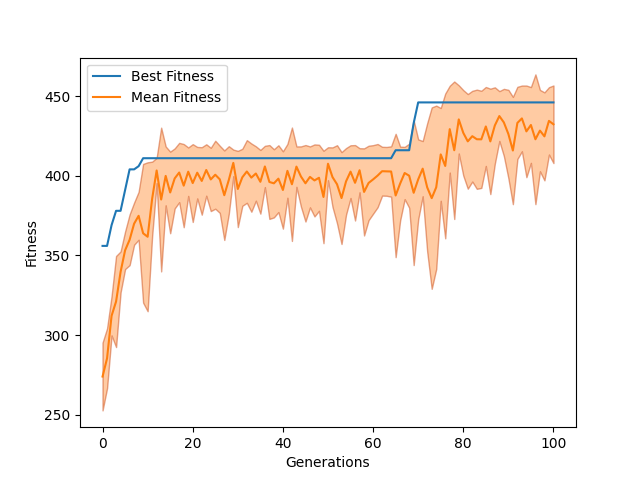

# Pyrimidine: Algebra-inspired Programming framework for genetic algorithms

**Abstract** 
`Pyrimidine` stands as a versatile framework designed for genetic algorithms, offering exceptional extensibility to accommodate a wide array of evolutionary algorithms, including particle swarm optimization and difference evolution. Leveraging the principles of object-oriented programming and the meta-programming, we introduce a novel container metaclass. This metaclass facilitates the construction of diverse structures for individual and population classes, conceptualized as algebraic systems. Within these systems, elements exhibit the capability to execute diverse operations, ranging from the mutation to the crossover of individuals in a population. Furthermore, these classes can seamlessly function as elements of higher-order classes, enabling the automatic implementation of sophisticated population-level operations, such as population migration. This distinctive design paradigm is coined as "algebra-inspired Programming," signifying the fusion of algebraic methodologies with the software architecture.

# Summary

As one of the earliest developed intelligent algorithms [holland, katoch], the genetic algorithm(GA) has found extensive application across various domains and has undergone modifications and integrations with new algorithms [@alam, @cheng,@katoch]. The principles of GA will not be extensively reviewed in this article. For a detailed understanding, please refer to reference [@holland, @simon] and the associated literatures.

This article introduces `pyrimidine`, a general algorithm framework for GA and any other evoluationary algorithm. Adhering rigorously to object-oriented programming (OOP) principles, `pyrimidine` distinguishes itself from other libraries, making effective use of Python's meta-programming capabilities.

# Algebra-inspired Programming

As is well-known, ther are wo fundamental concepts in GAs: individuals( or chromosomes) and populations.

In a typical Python implementation, populations are initially defined as lists of individuals, with each individual representing a chromosome composed of a list of genes. Creating an individual can be achieved utilizing either the standard library's `array` or the widely-used third-party library `numpy`[@numpy]. Following this, evolutionary operators are defined and applied to these structures.

Our design concept transcends the ordinary and embraces a higher level of extensibility. We term this innovative approach "algebra-inspired Programming." It should not be confused with so-called algebraic programming, but it draws inspiration from its underlying principles.

## Mathematical representation

We introduce the concept of a **container**, simulating an abstract algebraic system where specific operators are not yet defined.

We represent a **container** $s$ of type $S$, with elements of type $A$, using the following expression:
$$
s = \{a:A\}:S
$$
Here, the symbol $\{\cdot\}$ signifies either a set or a sequence, emphasizing the order of the elements.

Expanding on this conceptual foundation, we articulate the definition of a population as a container of individuals. The introduction of multi-population extends this idea, representing a container of populations, commonly denoted as "the high-level container." What sets `pyrimidine` apart is its innate capability to seamlessly implement multi-population genetic algorithms. The populations in a multi-population behaves like the individuals in a population. Notably, it allows the definition of containers at higher levels, such as a container of multi-populations, potentially intertwined with conventional populations.

While an individual can be conceptualized as a container of chromosomes, it will not necessarily be considered a system. Similarly, a chromosome might be viewed as a container of genes. In practice, we choose to implement chromosomes directly using `numpy.array` or `array.array`.

In our framework, a container that defines operators for its elements is referred to as a **system**. For instance,in the population system $s$, the crossover operation of two individuals, denoted as $a \times_s b$ mathematically, can be implemented as `s.cross(a, b)`. Although this system concept aligns with algebraic systems, the current version of our framework diverges from this notion, as operators are directly defined as methods of the elements, such as `a.cross(b)`. While the relevant consideration is postponed to future releases, this potential change will not disrupt the design of APIs.

The lifting of a function/method $f$ is a common approach to defining the function for the entire system:
$$
f(s) := \{f(a)\}
$$
unless explicitly redefined. For example, the mutation of a population typically involves the mutation of all individuals in it, but there are cases where it may be defined as the mutation of a randomly selected individual. Another type of lifting is that the fitness of a population is determined as the maximum of the fitness values among the individuals in the population.

`transition` is the primary method in the iterative algorithms, denoted as a transform:
$$
T(s):S\to S
$$
The iterative algorithms can be represented as $T^n(s)$. It is also possible to lift method `transition` to higher containers.

New features will be incorporated based on the structure.

## Metaclasses
The metaclass `System` is defined to simulate abstract algebraic systems, which are instantiated as a set containing a set of elements, as well as operators and functions on them.

`Container` is the super-metaclass of `System` for creating containers.

## Mixin classes

Metaclasses define what the algorithm is, while mixin classes specify what the algorithm does. 

The mixin class `FitnessMixin` is responsible for the iteration aiming to maximize the fitness, and its subclass `PopulationMixin` represents the "collective" form.

When designing a new algorithm that may much differ from GA, it is recommended to inherit from the mixin classes initially, especially overriding the `transition` method, though it is not coercive.

When designing a new algorithm, especially one that significantly differs from a GA, it is advisable to start by inheriting from the mixin classes and redefining the `transition` method, though this is not mandatory.

<!--
IterativeMixin  - - ->  CollectiveMixin
    |                      |
    |                      |
    v                      v
FitnessMixin  - - ->  PopulationMixin
-->

## Fundamental Classes

There are three fundamental classes in `pyrimidine` constructed by the metaclasses: `BaseChromosome`, `BaseIndividual`, `BasePopulation`, to create chromosomes, individuals and populations respectively.

For convenience, `pyrimidine` provides some commonly used subclasses, so users do not have to redefine these settings. By inheriting these classes, users gain access to the methods such as, crossover and mutation. `pyrimidine` offers `BinaryChromosome` for the binary encoding as used in the classical GA.

Generally, the algorithm design starts as follows, where `MonoIndividual`, as an individual class, just enforces that the individuals can only have one chromosome.

```python
class UserIndividual(MonoIndividual):
    element_class = BinaryChromosome
    default_size = 8

    def _fitness(self):
        # Compute the fitness

class UserPopulation(StandardPopulation):
    element_class = UserIndividual
    default_size = 10
```

In the codes, `UserIndividual` is an individual class with `BinaryChromosome` as its chromosome type. It is equivalent to set 

```python
UserIndividual = MonoIndividual[BinaryChromosome]
```

The expression is borrowed from the module [typing](https://docs.python.org/3.11/library/typing.html?highlight=typing#module-typing) [@typing]. One can also use the helper `binaryIndividual(size=8)` to create the same class. 

The class `UserPopulation` is defined to create a population of the individuals. The method of executing standard genetic operations has been implemented in the class.

Algebraically, there is no different between `MonoIndividual` and a single `Chromosome`. And the population also can be treated as a container of chromosomes. See the following codes where use need not create an individual class.

```python
class UserChromosome(BaseChromosome):
    def _fitness(self):
        # Compute the fitness

UserPopulation = StandardPopulation[UserChromosome]
```

# An example to begin

In this section, we demonstrate the basic usage of `pyrimidine` with a simple example: the classic 0-1 knapsack problem with $n=50$ dimensions. (Refer to more examples in the repository.)

$$
\max \sum_i c_ix_i \\
\sum_i w_ix_i \leq W, \\
\quad x_i=0,1,i=1,\cdots,n
$$

The problem solution can be naturally encoded in binary format without requiring additional decoding.


```python
from pyrimidine import MonoIndividual, StandardPopulation, BinaryChromosome
from pyrimidine.benchmarks.optimization import Knapsack

n = 50
_evaluate = Knapsack.random(n)  # A function mapping n-dimensional binary encoding to the objective function value

class UserIndividual(MonoIndividual):
    element_class = BinaryChromosome // n
    def _fitness(self):
        # The return value must be a number
        return _evaluate(self.chromosome)

"""
equivalent to:
UserIndividual = MonoIndividual[BinaryChromosome // n].set_fitness(lambda o: _evaluate(o.chromosome))

or with the helper:
UserIndividual = makeIndividual(n_chromosomes=1, size=n).set_fitness(lambda o: _evaluate(o.chromosome))
"""

UserPopulation = StandardPopulation[UserIndividual] // 20
```

You also see that the equivalent expressions no longer explicitly depends on class inheritance, making the code more concise and similar to algebraic operation.

We can also consider chromosomes as the elements of the population, and define an individual as follows:
```
UserIndividual = (BinaryChromosome // n).set_fitness(lambda o: _evaluate(o.chromosome))
```

To further streamline the code, we integrate all the components into a single line:
```UserPopulation = StandardPopulation[BinaryChromosome // n].set_fitness(_evaluate)```


Finally, the optimal individual can be obtained with `pop.best_individual`, and `pop.solution` decodes it to the solution of the problem.

```python
pop = UserPopulation.random()
pop.evolve(n_iter=100)
```

# Visualization

Instead of implementing visualization methods, `pyrimidine` yields a `pandas.DataFrame` object that encapsulates statistical results for each generation by setting `history=True` in `evolve` method. Users can harness this object to plot the performance curves. Generally, users are required to furnish a "statistic dictionary" whose keys are the names of the statistics, and values are functions mapping the population to numerical values (strings are confined to pre-defined methods or attributes of the population).

```python
# statistic dictionary, computing the mean fitness and best fitness of each generation
stat = {'Mean Fitness': 'mean_fitness',
'Best Fitness': 'max_fitness'}

# obtain the history data, i.e. the statistical results, through the evolution.
data = pop.evolve(stat=stat, n_iter=100, history=True)

# draw the results
import matplotlib.pyplot as plt
fig = plt.figure()
ax = fig.add_subplot(111)
data[['Mean Fitness', 'Best Fitness']].plot(ax=ax)
ax.set_xlabel('Generations')
ax.set_ylabel('Fitness')
plt.show()
```

Here, `mean_fitness` and `max_fitness` denote the average fitness value of the population and the optimal individual fitness value, respectively. Notably, they inherently encapsulate functions (could be wrapped by `property` decorator) to perform statistical operations, for instance, `mean_fitness` corresponds to the mapping `pop->np.mean(pop.get_all_fitness())`.




# Create your own classes and algorithms
In the standard GA, the mutation rate and crossover rate remain constant and uniform throughout the entire population during evolution. However, in self-adaptive GAs, these rates can be dynamically encoded in each individual, allowing for adaptability during iterations. It is remarkably simple to implement self-adaptability by `pyrimidine`. 

We introduce a "mixed-individual," consisting of two chromosomes of different types: `BinaryChromosome`, representing the solution, and `FloatChromosome`, encapsulating the probabilities of mutation and crossover.

```python
class NewIndividual(MixedIndividual):
    element_class = (BinaryChromosome // 8, FloatChromosome // 2)

    def mutate(self):
        # Mutation based on the second chromosome
    def cross(self, other):
        # Crossover based on the second chromosome
    def _fitness(self):
        # Get fitness only depended on the first chromosome


NewPopulation = StandardPopulation[NewIndividual] // 20
```

Here, `FloatChromosome` comes pre-equipped with genetic operations tailored for floating-point numbers, obviating the necessity for user-defined specifications.


# Comparison with other frameworks

Various GA frameworks have been designed, such as `DEAP` and `gaft`. `Pyrimidine`'s design is heavily influenced by these frameworks. The following table compares `pyrimidine` with several popular and mature frameworks:

| Library   | Design Style      | Versatility | Extensibility | Visualization           |
| --------- | ------------------ | ---------- | ------------- | ---------------------- |
| `pyrimidine`| OOP, Meta-programming, Algebra-insprited | Universal | Extensible | export the data in `DataFrame` |
| `DEAP` [@fortin]     | OOP, Functional, Meta-programming        | Universal | Limited by its philosophy   | export the data in the class `LogBook`  |
| `gaft`      | OOP, decoration partton   | Universal | Extensible    | Easy to Implement       |
|`geppy` | based on `DEAP` | Symbolic Regression | Limited | - |
| `tpot`[@olson]/`gama`[@pieter]     | `scikit-learn` Style | Hyperparameter Optimization | Limited | None                   |
| `gplearn`/`pysr`   | `scikit-learn` Style | Symbolic Regression | Limited | None                   |
| `scikit-opt`| `scikit-learn` Style | Numerical Optimization | Unextensible | Encapsulated as a data frame      |
|`scikit-optimize`|`scikit-learn` Style  | Numerical Optimization | Very Limited | provide some plotting function |
|`NEAT`[@neat-python]| OOP  | Neuroevolution | Limited | use the visualization tool `visualize` |

`tpot/gama`, `gplearn/pysr`, and `scikit-opt` follow the `scikit-learn` style [@sklearn_api], providing fixed APIs with limited extensibility. They are merely serving their respective fields effectively (as well as `NEAT`).

`DEAP` is feature-rich and mature. However, it primarily adopts a tedious meta-programming style. Some parts of the source code lack sufficient decoupling, limiting its extensibility. `gaft` is a highly object-oriented software with excellent scalability, but it is currently inactive.

In `pyrimidine`, various operations on chromosomes are treated as methods, rather than top-level functions. When users customize chromosome operations, they only need to inherit the base chromosome class and override the corresponding methods.

We have implemented a variety of intelligent algorithms by `pyrimidine`, including adaptive genetic algorithms[@hinterding], quantum genetic algorithms[@supasil], differential evolution, evolutionary programming, particle swarm optimization[@wang], bat algorithm, gravity search algorithm, as well as some local search algorithms.


# Conclusion

I have conducted extensive experiments and improvements, showcasing that `pyrimidine` is a versatile framework suitable for implementing various evolution algorithms. Its design offers strong extensibility, allowing the implementation of any iterative model, such as simulated annealing or particle swarm optimization. For users developing new algorithms, `pyrimidine` is a promising choice.

Additionally, it uses numpy's arrays, which may result in slower crossover operations compared to DEAP's; however, alternative implementations can be employed. Naturally, there are other areas for improvement.

The entire source code has been uploaded to [GitHub](https://github.com/Freakwill/pyrimidine), including numerous examples. Moreover, it's worth mentioning that the documentation for `pyrimidine` is still under development.

# References